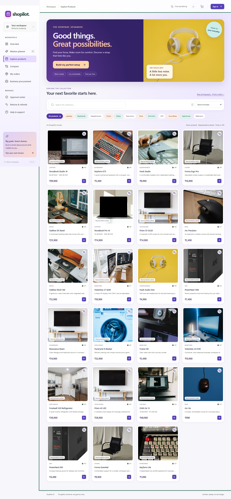
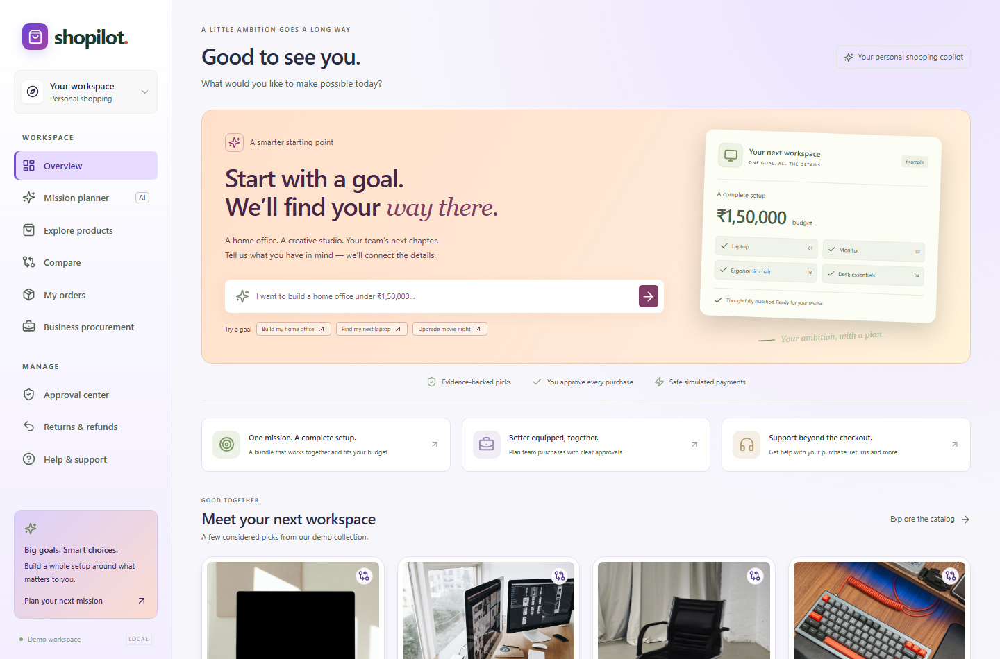
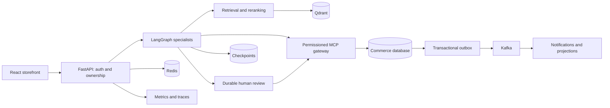

# ShopPilot AI

### From a shopping goal to a reviewed purchasing plan

**React 19 · TypeScript · FastAPI · LangGraph · MCP · PostgreSQL · Kafka**

ShopPilot turns requests such as “build my home office under ₹1,50,000” into a catalog-grounded bundle. It coordinates specialists, checks budget and compatibility, pauses for human approval, and executes a protected mock checkout. Item-level returns, procurement and recovery complete the local commerce journey.

[Quick start](#quick-start) · [Architecture](docs/architecture.md) · [Documentation](docs/README.md) · [API](docs/API.md) · [Contributing](CONTRIBUTING.md)

> **Locally validated release candidate.** Catalog products, payments and shipments are simulated. Full Docker runtime, staging deployment and other [release gates](docs/RELEASE_READINESS.md) remain open. This is not a production certification.



<details>
<summary>Homepage mission planner</summary>



</details>

Photos illustrate fictional products. See [photo sources](docs/PHOTO_SOURCES.md).

## Explore the application

| Journey | What happens |
|---|---|
| Shopping | Requirements → evidence → available products → compatible, budgeted bundle |
| Checkout | Immutable quote → owner/manager review → atomic mock order |
| Procurement | Business details and terms → independent approval → JSON purchase order |
| After-sales | Owned-order support, item refunds/replacements and remaining quantities |
| Operations | Specialist records, progress, notifications and audited recovery |

### Engineering highlights

- **12 bounded specialist graphs** with objectives, scoped identity, timeouts and execution records. Optional read-only model/tool loops; financial rules remain in application code.
- **7 MCP services** with signed short-lived capabilities and permission checks on both sides.
- **Learned retrieval** with BGE embeddings, MiniLM reranking, source metadata and SQL fallback.
- **Durable review** using checkpoints, execution leases, idempotency and a transactional outbox.
- **Responsive UI** with keyboard navigation, photography and browser regression checks.

## Architecture at a glance



Local mode substitutes SQLite and in-process tools/consumers. The [full architecture](docs/architecture.md) explains trust boundaries, agent flow, checkout sequence, data relationships and deployment profiles.

## Quick start

Prerequisites: **Python 3.12, Node.js 24 and uv**. From the cloned or extracted repository:

```bash
uv sync --frozen --python 3.12
uv run alembic upgrade head
uv run python -m backend.bootstrap
npm --prefix frontend ci
npm --prefix frontend run build
```

Start the API:

```bash
uv run uvicorn backend.main:app --host 127.0.0.1 --port 8000
```

In another terminal:

```bash
npm --prefix frontend run preview -- --port 5173
```

Open **http://127.0.0.1:5173**. Development API docs: **http://127.0.0.1:8000/docs**. After installing dependencies, Windows users can also run `.\scripts\start-local.ps1`.

No paid provider is required. Defaults use lexical retrieval. For learned retrieval, set `RETRIEVAL_BACKEND=learned` before API startup (PowerShell: `$env:RETRIEVAL_BACKEND='learned'`). First use downloads weights into `data/models`.

### Full Docker stack

With Docker Engine running and Compose v2 available:

```bash
docker compose up --build -d
```

This adds PostgreSQL, Redis, Kafka, Qdrant, MinIO, MCP and monitoring. First startup includes model downloads. The [verification script](scripts/verify-stack.ps1) uses an isolated project and checks stores, monitoring, approval restart and broker recovery. **The full stack has not been runtime verified in the development sandbox.**

### Demo accounts

Seeded local password: **`ShopPilot-demo-2026!`**

| Role | Email |
|---|---|
| Shopper | `alex@shopilot.demo` |
| Business user | `business@shopilot.demo` |
| Manager | `manager@shopilot.demo` |
| Administrator | `admin@shopilot.demo` |

These are public demo credentials; production disables seeding. Follow the [demo walkthrough](docs/DEMO.md).

## Repository map

```text
backend/            API, transactions, workflows, retrieval and security
frontend/           React UI, photos and Playwright browser tests
mcp_servers/        Seven capability-specific MCP processes
migrations/         Explicit Alembic schema history
infrastructure/     Containers, proxy, monitoring and cluster templates
scripts/            Launcher, evaluations, load and stack verification
tests/              Backend, API, concurrency and integration tests
docs/               Architecture, onboarding, API and operating guides
verification/       Local reports; not a live CI status badge
.github/            CI, issue forms and pull-request template
```

## Validation

Recorded full regression: **35 backend tests passed, 2 server-dependent tests skipped; 4 browser tests passed**. Learned retrieval: 24 authored cases, MRR@8 0.8903 and recall@3 0.9583. These are local results, not production capacity or independent model-quality claims.

```bash
uv run pytest -q
uv run ruff check backend mcp_servers tests scripts
uv run mypy backend
npm --prefix frontend run build
```

[Testing instructions](docs/TESTING.md) · [Recorded evidence](docs/VERIFICATION.md) · [CI workflow](.github/workflows/ci.yml)

## Learn and contribute

- [Documentation map](docs/README.md) and [developer onboarding](docs/DEVELOPMENT.md)
- [Agents](docs/agent-architecture.md), [retrieval](docs/rag-architecture.md) and [design decision](docs/decisions/001-durable-commerce.md)
- [Contributing](CONTRIBUTING.md) and [security reporting](SECURITY.md)
- [Readiness](docs/RELEASE_READINESS.md), [configuration](docs/CONFIGURATION.md) and [runbook](docs/RUNBOOK.md)
- [Roadmap](docs/ROADMAP.md) and [feature matrix](docs/FEATURE_STATUS.md)

## License and assets

No open-source license has been selected for the application code. Public visibility alone does not grant reuse permission. See [NOTICE](NOTICE.md) for third-party assets. The owner should select a code license before inviting open-source reuse.
