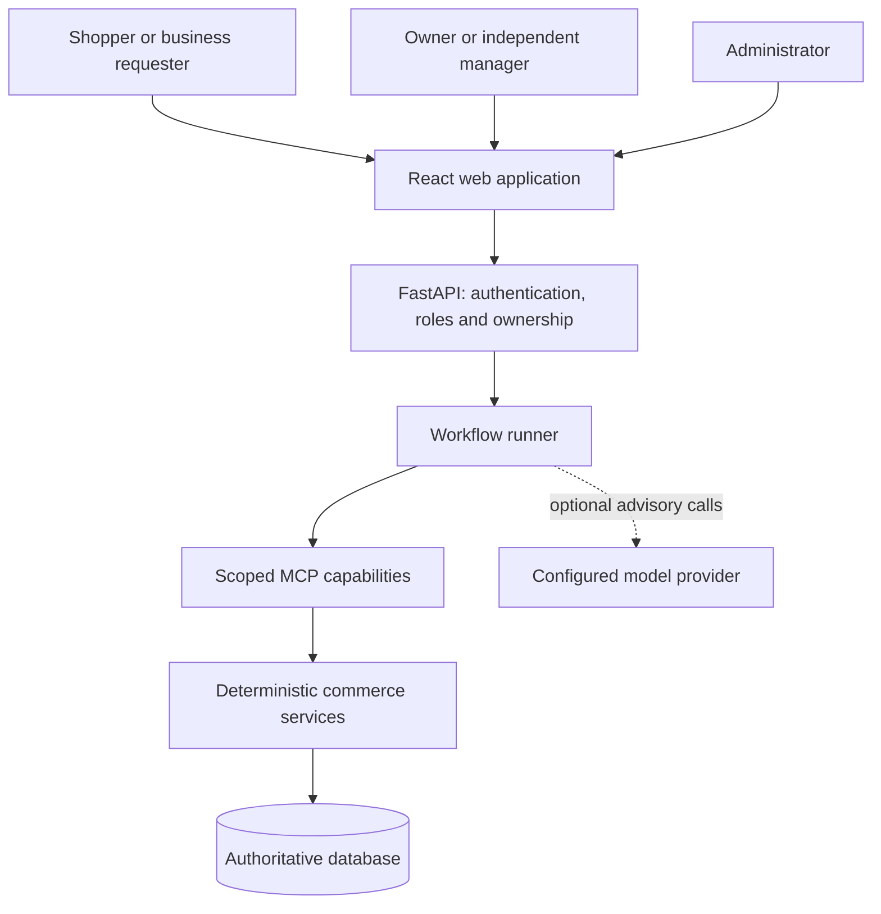
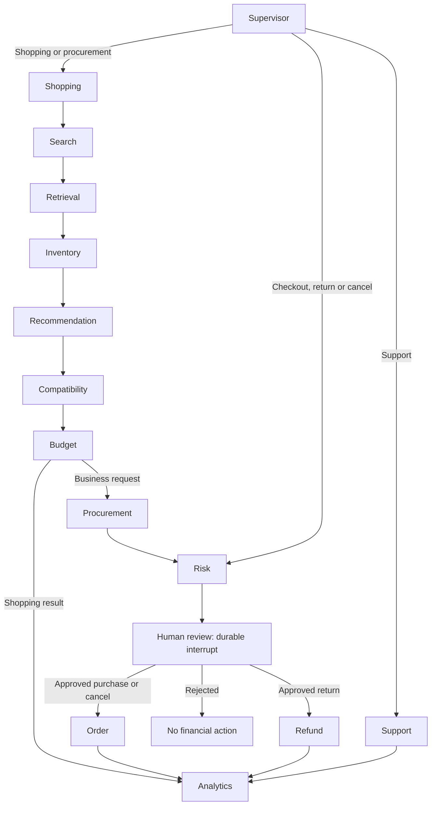
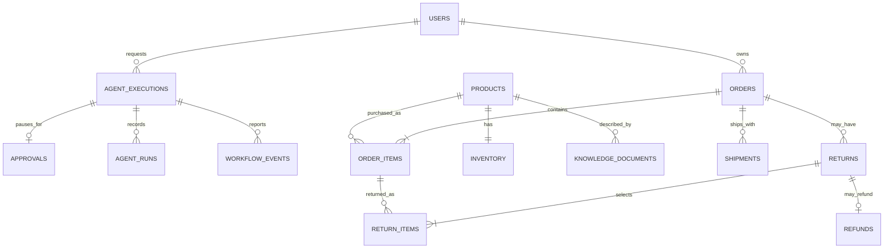
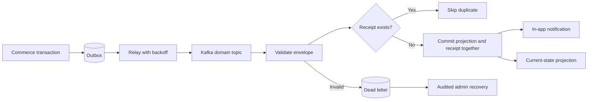
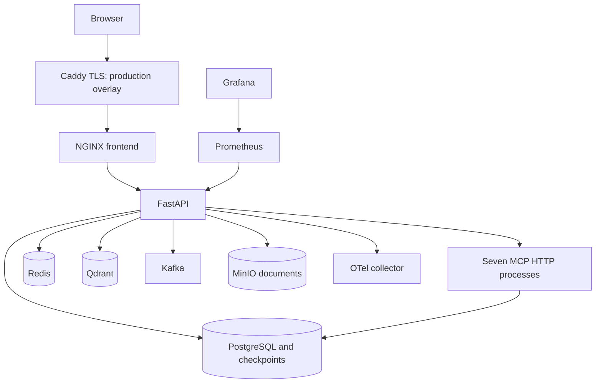

# System architecture

ShopPilot is a modular commerce application with bounded agent orchestration. Commercial decisions must be grounded, reviewable and recoverable. MCP processes can be deployed separately, while mock checkout intentionally retains one SQL transaction boundary.

## Context and trust boundaries



Model text cannot set authoritative prices, grant permissions or approve a transaction. The API authenticates the user, both tool boundaries check the capability, and commerce services recheck ownership, stock, quote and approval. Optional model loops gather read-only evidence.

## Components and code map

| Component | Responsibility | Source |
|---|---|---|
| Frontend | Shopping, review and operations UI | [frontend/src](../frontend/src) |
| API | Validation, auth, workflow creation and SSE | [main.py](../backend/main.py) |
| Runner | Leases, graph execution, checkpoints and resume | [workflows.py](../backend/workflows.py) |
| Specialists | Twelve subgraphs, output contracts, timeout and telemetry | [specialists.py](../backend/specialists.py) |
| Model loop | Optional bounded inspection using scoped read tools | [agent_models.py](../backend/agent_models.py) |
| Tool boundary | Allowlists, signed capabilities and transport | [tools.py](../backend/tools.py), [server.py](../mcp_servers/server.py) |
| Commerce | Atomic mock checkout and item returns | [commerce.py](../backend/commerce.py) |
| Retrieval | Evidence planning, vectors, reranking and source checks | [rag.py](../backend/rag.py), [semantic.py](../backend/semantic.py) |
| Events | Outbox, deduplication, notifications and projections | [events.py](../backend/events.py) |
| Storage | Entities and schema evolution | [models.py](../backend/models.py), [migrations](../migrations) |

## Specialist workflow



The twelve specialists are shopping, search, inventory, recommendation, compatibility, budget, procurement, risk, order, refund, support and analytics. Supervisor, retrieval and review are orchestration nodes. Separate compiled graphs do not imply independent deployment processes or unrestricted purchasing agents. See [agent persistence](agent-architecture.md).

## Checkout sequence

```mermaid
sequenceDiagram
    actor User
    participant API
    participant Runner
    participant Store as DB and checkpoints
    participant MCP as MCP and commerce
    User->>API: Checkout with Idempotency-Key
    API->>Store: Save execution and quote snapshot
    API-->>User: 202 with execution ID
    Runner->>Store: Claim execution lease
    Runner->>Store: Save approval and interrupt checkpoint
    User->>API: Review exact items and approve
    API->>Store: Check reviewer; queue resume
    Runner->>Store: Resume same workflow thread
    Runner->>MCP: Scoped approved transaction
    MCP->>Store: Revalidate quote and conditionally decrement stock
    MCP->>Store: Commit order, mock payment, shipment and outbox
    Runner->>Store: Save result and checkpoint
    User->>API: Poll execution or receive SSE
    API-->>User: Completed order
```

Commerce and checkpoint commits are not a distributed atomic transaction. Stable operation identities and SQL constraints protect replay after a crash between them. Declined mock payments roll back the commerce transaction. A real provider needs a reservation/payment saga and reconciliation, not an HTTP call hidden inside SQL.

## Core relationships



This is a conceptual subset. Models and migrations define the actual DDL. Money uses integer rupees. Order items track returned quantity; cumulative rounding prevents repeated partial refunds from exceeding the amount paid.

## Events and recovery



Delivery is at least once. Projections use authoritative current order state, preventing old events from regressing an aggregate. Consumers never charge or deduct stock again. No external emails are sent. Recovery requires an administrator and a reason; replay cannot bypass envelope validation.

## Deployment profiles



| Profile | Storage | Tools | Retrieval | Events |
|---|---|---|---|---|
| Local defaults | SQLite | In-process registry | Lexical | Local consumers |
| Local learned | SQLite | In-process registry | BGE and MiniLM on CPU | Local consumers |
| Docker development | PostgreSQL | MCP HTTP | Learned and Qdrant | Kafka |
| Production overlay | PostgreSQL; no demo seed | MCP HTTP | Learned and Qdrant required | Kafka required |

The production overlay is a single-host candidate, not an HA platform. Kubernetes files are templates. Store integrations and full Docker runtime remain unverified here. See [configuration](CONFIGURATION.md), [readiness](RELEASE_READINESS.md), [ADR-001](decisions/001-durable-commerce.md) and [transaction details](system-design.md).
