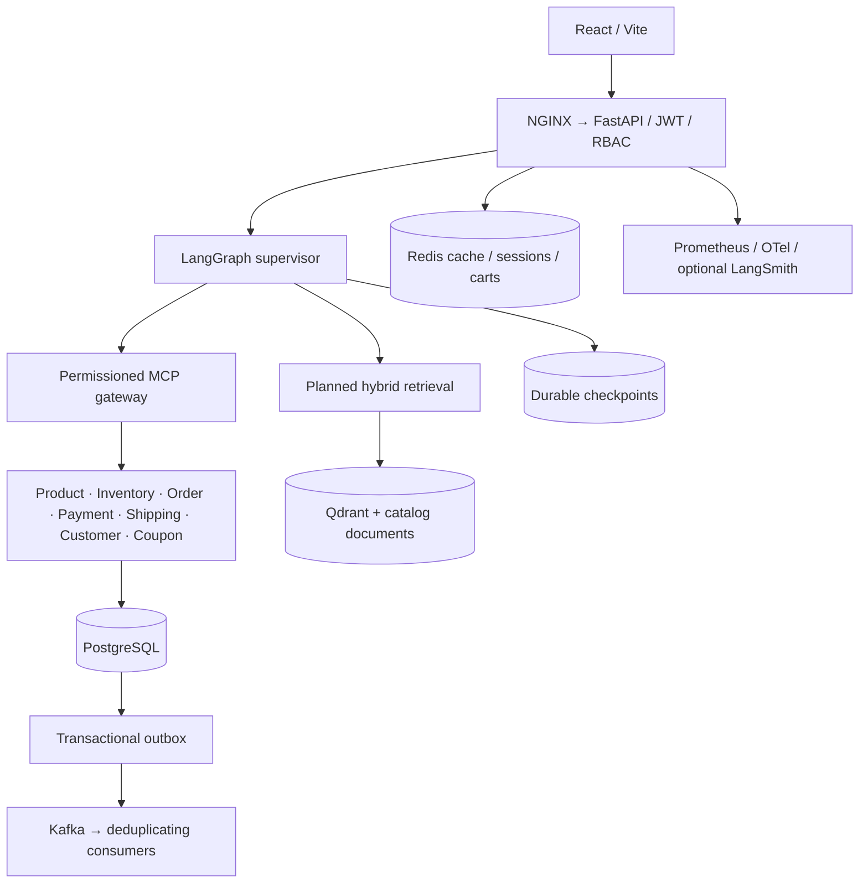

# ADR-001: Durable modular commerce with permissioned tools

**Status:** Accepted · **Date:** 2026-09-15

## Context

ShopPilot needs a credible end-to-end local demonstration without paid credentials, while retaining PostgreSQL, Redis, Kafka, MCP, and LangGraph production integration points.

## Decision

Use a modular FastAPI application and seven MCP service processes. Agents reach exposed business capabilities through the MCP gateway. A local transport invokes the same validated tool registry; Docker uses the official MCP HTTP protocol. SQLite plus file-backed LangGraph checkpoints supports dependency-light local verification; PostgreSQL and PostgresSaver are the full-stack path. All money uses integer rupees. Prices, stock and policies are fetched from persisted catalog records.

## Options considered

| Option | Complexity | Cost | Scaling |
|---|---|---|---|
| Independent microservice databases immediately | High | High | Independent but requires a distributed financial saga |
| Modular transaction boundary + MCP processes | Medium | Low locally | Horizontal API and tool workers; shared DB constraints |
| In-memory demo | Low | Low | Loses approvals and orders on restart |

## Trade-offs and consequences

Order, mock payment, inventory and shipment are committed in one transaction. Conditional SQL stock decrements prevent overselling; unique idempotency keys protect duplicate actions. A transactional outbox avoids losing events between DB commit and Kafka publish. Real payment providers require a pending-payment saga, webhook authentication and reconciliation before replacing the mock. Kafka consumers never deduct stock again.

Redis accelerates reads and provides rate limits, ephemeral sessions and cart mirrors. The database remains authoritative; cache loss cannot lose a purchase or approval. Mutation retries rely on persistent idempotency, not a Redis lock alone.

Workflow execution leases live in the database. Polling SSE reads durable public status events rather than exposing chain-of-thought. Checkpoints survive restarts. An approval binds a concrete quote/request; the policy engine revalidates stock, ownership, prices and approval when executing.

## Action items

- Implement services and tool boundaries with integration tests.
- Test restart/resume, overselling, denied tools, duplicate requests and payment failure.
- Mark integrations not exercised against running infrastructure in the delivery checklist.

## Architecture

